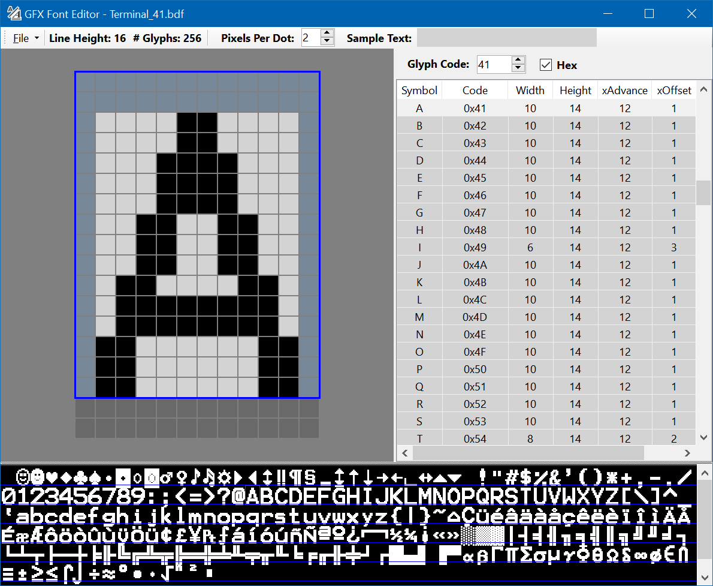

# GFX Font Editor
An editor for bitmap fonts for use with the Adafruit Arduino GFX Libraries.

## Supported font file formats

### GFXfont C header (.h) file (Load & Save)
These header files are used by the Adafruit GFX Libraries using the Arduino framework.
They define the font in C program code as a list of character glyph bitmap definitions and are compiled into the program.
Unlike some other font formats, the glyphs are required to be a sequential list free of gaps and duplicates in the character codes they represent.
So, after loading other formats, the list may need to be filled with blank glyphs, or the list compressed and codes reassigned.
The 'Flatten Glyph List' command in the Glyph List context menu does just that.
The possible range of C language syntax in a header file representing the construction of a valid
GFXfont is far too complex to parse here, so some errors may be detected in 'non-standard' files.
The parsing done is sufficient to handle the representative samples that Adafruit has published at the time.
The set of fonts provided with the Adafruit GFX libraries can also be seen on [GitHub](https://github.com/adafruit/Adafruit-GFX-Library/tree/master/Fonts).

### Glyph Bitmap Distribution Format (BDF) files (Load & Save)
The BDF format was defined decades ago, but is still in use, especially by the Adafruit CircuitPython GFX Libraries.
There are also many examples available on the internet.
Check out Rob Hagemans' hoard-of-bitfonts on [GitHub](http://robhagemans.github.io/monobit/) where you can browse and download
BDF versions many useful fonts!
These can be also saved as font header files for use with Arduino.
When loading fonts in other formats, you may need to 'Edit Font Properties' before saving as BDF as some font properties not
available in other formats are required for use in CircuitPython.
GFX Font Editor saves only a few properties useful with CircuitPython and NOT the full set that may have been loaded
which may be useful or required by other processes.

### GFX Font Editor XML format (.gfxfntx) (Load & Save)
This format is exlusively for the GFX Font Editor to preserve the full state of an editing session,
as an 'agnostic' format when working with multiple other formats.

### GFX Font Editor Binary format (.gfxfntb) (Load & Save)
This format is essentially a memory image of what would be compiled into a program when using the header file format.
These files can be dynamically loaded from any suitable file resource into memory on demand, and then freed when no longer needed.
A BinaryFontDemo program can be found on [GitHub](https://github.com/ScottFerg56/BinaryFontDemo/tree/main).
The program uses an [Adafruit ESP32 Feather V2](https://www.adafruit.com/product/5400)
and an [Adafruit ILI9341 TFT FeatherWing](http://www.adafruit.com/products/3315),
reading the binary font file from ESP32 SPIFFS (Serial Peripheral Interface Flash File System).

## GFX Font Editor User Interface

### Tool Bar
The File Menu contains the usual file operations, plus 'Edit Font Properties' for saving as BDF.
Blank properties will be supplied default values. Ascent and Descent are of particular value to the CircuitPython library.
The toolbar also displays the font's line height (yAdvance) property, the number of glyphs, the pixels per dot used to scale the
Font View, and the Sample Text to be rendered in the Font View.

### Glyph Edit Pane
The blue 'Glyph Box' shows the height of the font, as displayed in the tool bar, and the width of the selected glyph.
Drag the bottom (baseline) of the Glyph Box to change the font line height (effecting ALL glyphs in the font).
When dragging with SHIFT, ALL the glyphs are offset at the same time to maintain their relationships with the baseline.
Drag the right side of the box to adjust the selected glyph's amount of advance (the xAdvance) shown in the Glyph List.
When dragging with SHIFT, the same advance is set for ALL glyphs as a shorcut for creating or modifying a FIXED spacing font.
The white Bitmap Box shows the extent of pixels set for the glyph.
Use the left mouse button to paint and erase pixels.
Use the right mouse to click and drag all the pixels around as a whole.
Dark gray pixel blocks show the fuller extent of all glyphs outside the main character box.

### Glyph List
Select a glyph to edit from the Glyph List.
The glyph's Code value can be changed with the control just above the list, using the updown arrows or by entering a new value.
The glyph may jump around in the list which is kept in sorted order.
The 'Hex' check box allows for entry in either hexadecimal or decimal.
Other values shown for each glyph reflect the state of the glyph as edited in the Glyph Edit Pane
and are written, as required by the format, to the saved output files.
Multiple glyphs may be selected for operations in the (right click) Context Menu.
There you will find commands for list management and cut and paste, as well as operations
to rotate and flip the image of the glyph.
The Context Menu also contains the Flatten Glyph List command
which will ensure a sequential list of glyphs without Code gaps or duplicate Codes.
This flattening is required for fonts to be saved in the header (.h) file format.
After flattening, you may see some glyph entries displayed in dim colors or red
to note inserted blanks or glyphs with code values changed.
To keep the in-memory size of a font to a reasonable value, large gaps are not allowed
and will result in the font Codes to be compressed at the end and highlighted in red.
Duplicate codes are distributed to gaps or moved at the end.
It may be of interest to manually reorder or note the new codes for these highlighted glyphs.

### Font View
The currently selected glyph is highlighted in the view with a red bounding box
and a glyph can be selected with a click in the view.
Use the PixelsPerDot control in the Tool Bar to scale the view.
The Sample Text control in the Tool Bar establishes the set of glyphs to view.
When left blank, all glyphs will be displayed.
Characters can be entered with the keyboard, or specific code values can be entered
by number as an escape code in the style of \u0000 with FOUR hex digits. Two slashes '\\\\' are required
to represent a single slash '\\'.
Characters in the Sample Text not present in the font glyph list have placeholders in the view of a vertical yellow bar.
